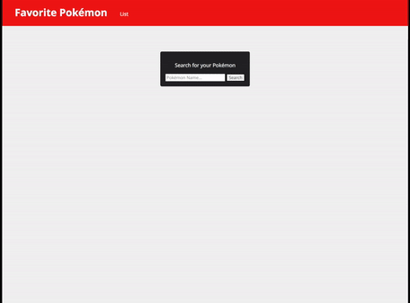
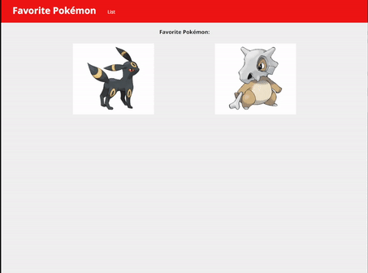

# Pok&eacute;mon Tracker

A dynamic HTML, CSS, and JavaScript solo project for Trainers who want to keep track of their Pok&eacute;mon.

## Why I Built This

As a gamer, I wanted to build an application that was simple and easy to track Pok&eacute;mon I needed to catch/find.

## Technologies Used

- HTML5
- JavaScript
- CSS3
- [Pok&eacute;mon Api](https://pokeapi.co/)

## Live Demo

Here is a link to try the application live: [https://marvinloreto.github.io/ajax-project/#](https://marvinloreto.github.io/ajax-project/#)

## Finished Features

1. User can search for Pok&eacute;mon.
2. User can click Pok&eacute;mon to see more details.
3. User can add Pok&eacute;mon to the Favorite List.
4. User can see the Favorite List.
5. User can delete Pok&eacute;mon from their Favorite List.
6. User's Favorite List is saved to local storage.

## Preview




### Getting Started

1. Clone the repository.

    ```shell
    git clone https://github.com/marvinloreto/ajax-project.git
    ```

2. Open index.html with LiveReload Server.
